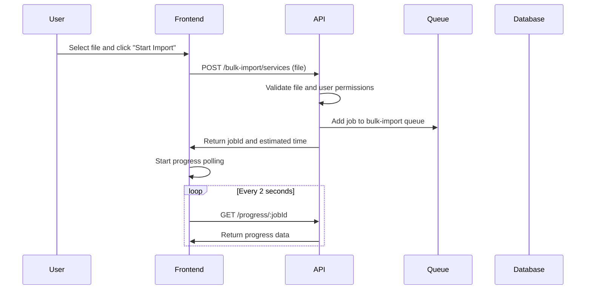
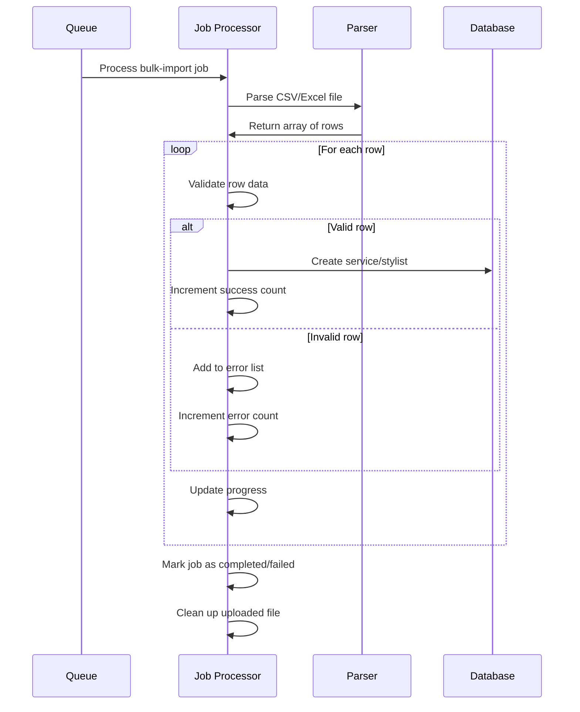

# Bulk Import Architecture

## Overview

The bulk import system allows salon owners to upload CSV/Excel files to create multiple services or stylists at once. The system is designed to handle large datasets efficiently using a queue-based architecture with comprehensive error handling and progress tracking.

## Architecture Components

### 1. Frontend Components

#### **BulkImportModal Component**
- **Location**: `frontend-nextjs/src/components/ui/BulkImportModal.tsx`
- **Purpose**: Reusable modal for both services and stylists bulk import
- **Features**:
  - File upload with drag-and-drop support
  - Template download functionality
  - Real-time progress tracking with polling
  - Error reporting and display
  - File validation (CSV/Excel, 10MB limit)

#### **Integration Points**
- **Services Page**: `frontend-nextjs/src/page-components/salon/ServicesPage.tsx`
- **Stylists Page**: `frontend-nextjs/src/page-components/salon/StylistPage.tsx`
- Both pages include "Bulk Import" button and modal integration

### 2. Backend Queue System

#### **BulkImportJobs Class**
- **Location**: `backend/src/queues/jobs/BulkImportJobs.ts`
- **Purpose**: Handles asynchronous processing of bulk import jobs
- **Job Types**:
  - `bulk-import-services`: Process service imports
  - `bulk-import-stylists`: Process stylist imports

#### **Queue Configuration**
- **Queue Name**: `bulk-import`
- **Concurrency**: 1 (process one import at a time to avoid database overload)
- **Retry Policy**: No retries (bulk imports are one-time operations)
- **Progress Tracking**: In-memory storage with real-time updates

### 3. API Endpoints

#### **Bulk Import Routes**
- **Location**: `backend/src/routes/bulkImport.ts`
- **Base Path**: `/api/v1/bulk-import`

**Endpoints:**
- `POST /services` - Upload CSV/Excel for service import
- `POST /stylists` - Upload CSV/Excel for stylist import
- `GET /progress/:jobId` - Check import progress
- `GET /template/services` - Download services CSV template
- `GET /template/stylists` - Download stylists CSV template
- `DELETE /cleanup/:jobId` - Clean up progress data

### 4. File Processing

#### **Supported Formats**
- **CSV**: Text-based comma-separated values
- **Excel**: .xlsx and .xls formats
- **File Size Limit**: 10MB maximum

#### **Parsing Libraries**
- **csv-parser**: For CSV file parsing
- **xlsx**: For Excel file parsing
- **fast-csv**: Alternative CSV processing

### 5. Data Templates

#### **Services Template**
```csv
name,description,price,duration,categoryName,popular,gender,isActive,emoji
Hair Cut & Style,Professional hair cutting and styling service,500,45,Hair Services,true,UNISEX,true,✂️
Hair Color,Full hair coloring service with premium products,1500,120,Hair Services,false,UNISEX,true,🎨
```

#### **Stylists Template**
```csv
name,email,phone,specialties,experience,isActive,serviceNames,canDoAllServices
John Doe,john.doe@example.com,+91 9876543210,"Hair Cutting, Hair Styling",5,true,"Hair Cut & Style, Hair Color",false
Jane Smith,jane.smith@example.com,+91 9876543211,"Facial Treatment, Skincare",3,true,,true
```

## Processing Flow

### 1. File Upload Flow



### 2. Queue Processing Flow



## Error Handling Strategy

### 1. File-Level Validation
- **File Type**: Only CSV and Excel files allowed
- **File Size**: Maximum 10MB limit
- **File Structure**: Validate required columns exist

### 2. Row-Level Validation
- **Required Fields**: Validate all mandatory fields are present
- **Data Types**: Ensure numeric fields are valid numbers
- **Business Rules**: Check email uniqueness, category existence, etc.

### 3. Error Collection
- **Partial Success**: Continue processing valid rows even if some fail
- **Error Details**: Collect row number, data, and specific error message
- **Error Reporting**: Display first 10 errors in UI, full list available

### 4. Rollback Strategy
- **No Automatic Rollback**: Successful records remain in database
- **Manual Cleanup**: Admin can manually remove imported records if needed
- **Duplicate Prevention**: Check for existing records before creation

## Scalability Considerations

### 1. Queue-Based Processing
- **Asynchronous**: Non-blocking file processing
- **Concurrency Control**: Limit concurrent imports to prevent database overload
- **Memory Management**: Process files in chunks for large datasets

### 2. Progress Tracking
- **In-Memory Storage**: Fast access for real-time updates
- **Cleanup**: Automatic cleanup of completed job data
- **Polling Optimization**: 2-second intervals balance responsiveness and load

### 3. Database Optimization
- **Batch Operations**: Use Prisma's `createMany` for efficient inserts
- **Transaction Management**: Group related operations
- **Index Usage**: Leverage existing indexes for lookups

## Security Measures

### 1. Authentication & Authorization
- **Role-Based Access**: Only salon owners can perform bulk imports
- **Salon Isolation**: Users can only import to their own salon
- **File Validation**: Strict file type and size validation

### 2. File Handling
- **Temporary Storage**: Files stored in secure upload directory
- **Automatic Cleanup**: Files deleted after processing
- **Path Validation**: Prevent directory traversal attacks

### 3. Data Validation
- **Input Sanitization**: Clean and validate all input data
- **SQL Injection Prevention**: Use Prisma ORM for safe database operations
- **Business Logic Validation**: Enforce salon-specific constraints

## Monitoring & Logging

### 1. Job Monitoring
- **Queue Stats**: Track job counts, processing times, success rates
- **Error Tracking**: Log all errors with context
- **Performance Metrics**: Monitor processing speed and resource usage

### 2. User Activity
- **Import History**: Track who imported what and when
- **Success Metrics**: Monitor import success rates
- **Error Patterns**: Identify common import issues

## Future Enhancements

### 1. Advanced Features
- **Preview Mode**: Show import preview before processing
- **Duplicate Detection**: Advanced duplicate handling options
- **Data Mapping**: Allow custom column mapping
- **Validation Rules**: Configurable validation rules per salon

### 2. Performance Improvements
- **Streaming Processing**: Process large files without loading entirely into memory
- **Parallel Processing**: Process multiple files simultaneously
- **Caching**: Cache category and service lookups

### 3. User Experience
- **Import History**: Show previous import jobs and results
- **Template Generator**: Dynamic template generation based on salon data
- **Bulk Updates**: Support for updating existing records
- **Export Functionality**: Export current data as templates

## Dependencies

### Backend
- **csv-parser**: ^3.0.0 - CSV file parsing
- **xlsx**: ^0.18.5 - Excel file parsing
- **fast-csv**: ^4.3.6 - Alternative CSV processing
- **bull**: ^4.16.5 - Queue management
- **multer**: ^2.0.2 - File upload handling

### Frontend
- **react-hot-toast**: Toast notifications
- **lucide-react**: Icons for UI
- **File API**: Browser file handling

## Configuration

### Environment Variables
```env
# Redis configuration for queues
REDIS_URL=redis://localhost:6379

# File upload limits
MAX_FILE_SIZE=10485760  # 10MB in bytes
UPLOAD_DIR=uploads/bulk-imports

# Queue settings
BULK_IMPORT_CONCURRENCY=1
BULK_IMPORT_CLEANUP_DELAY=300000  # 5 minutes
```

### Queue Settings
```typescript
// Default job options
{
  attempts: 1,           // No retries for bulk imports
  delay: 1000,          // 1 second delay before processing
  removeOnComplete: 5,   // Keep 5 completed jobs
  removeOnFail: 10      // Keep 10 failed jobs for debugging
}
```

This architecture provides a robust, scalable, and user-friendly bulk import system that can handle hundreds or thousands of records efficiently while maintaining data integrity and providing excellent user feedback.
